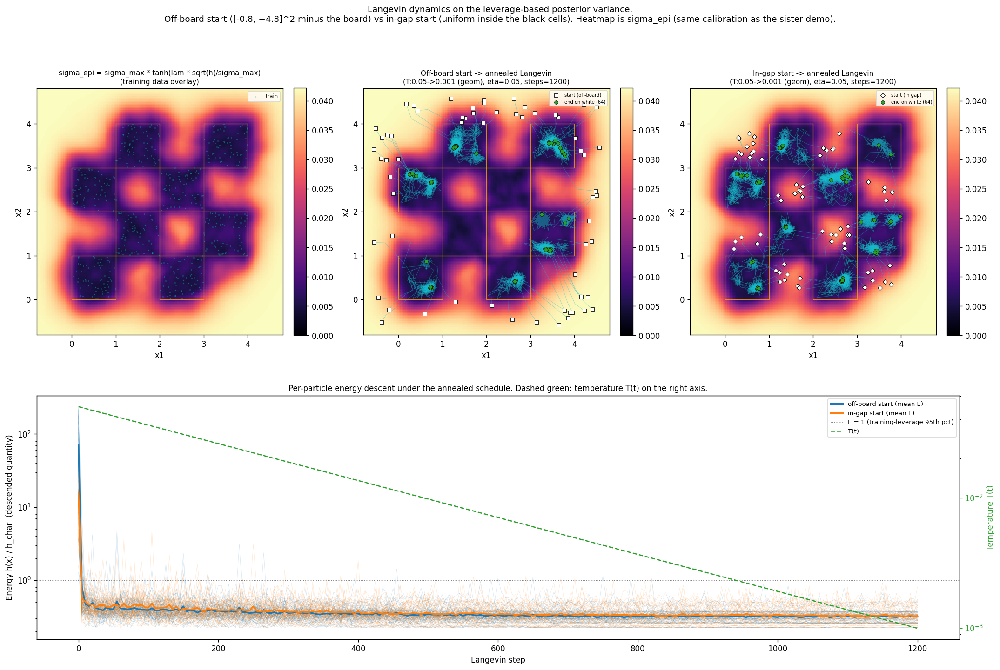
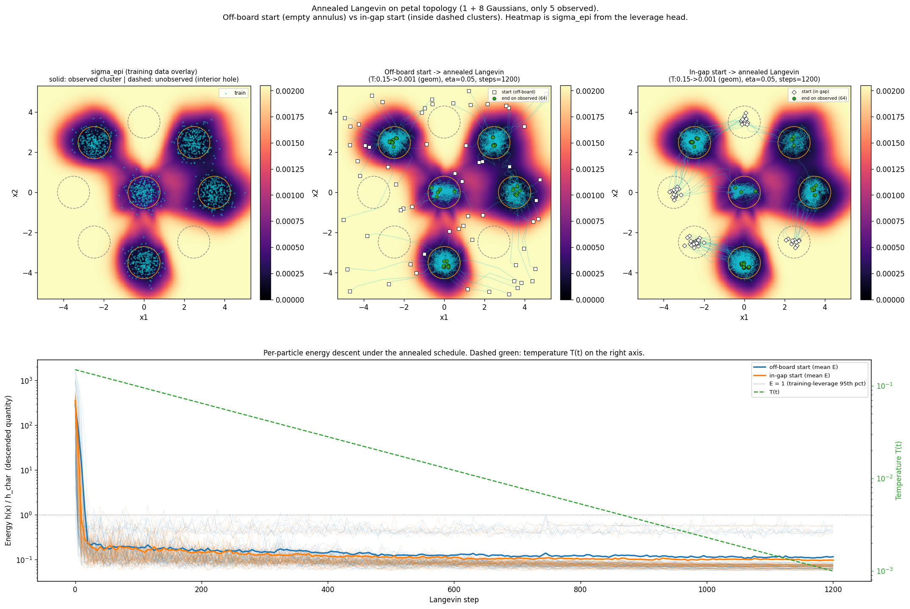
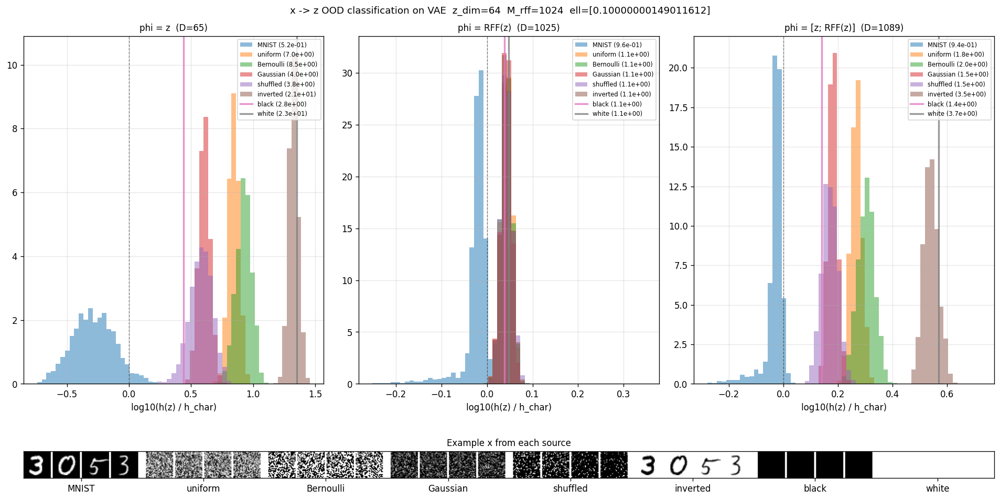
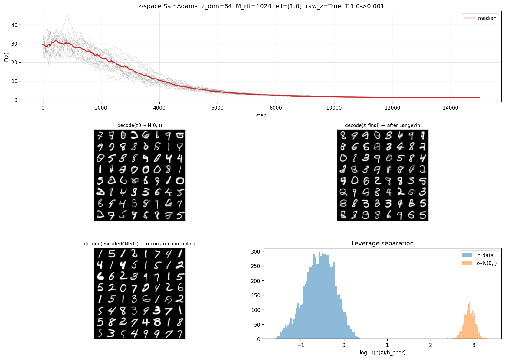
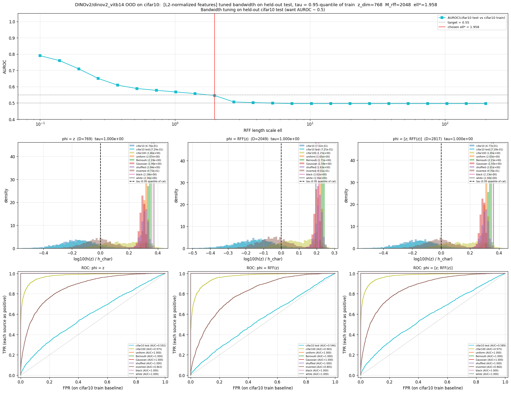
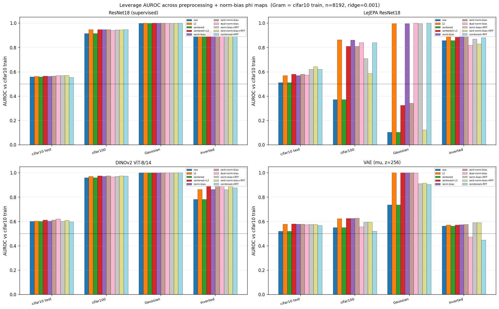
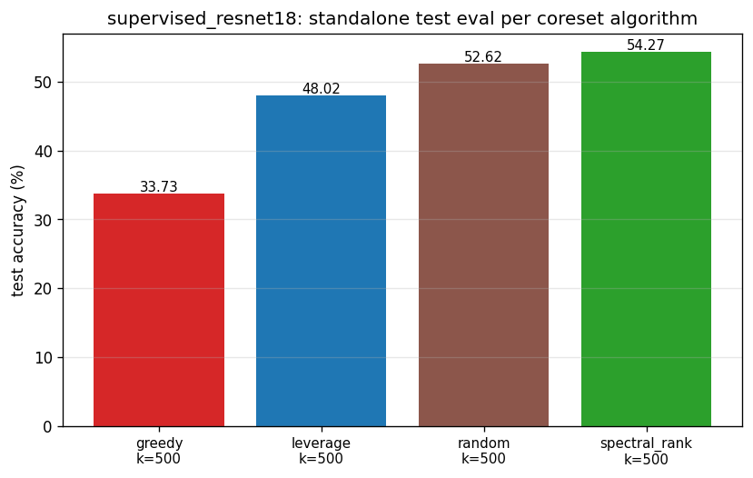
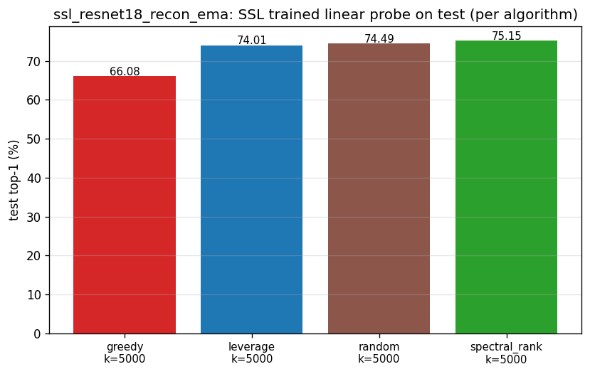

# ebmify

**ebmify any model.** Pick any feature extractor $\phi(x)$ — a trained
MLP's penultimate activations, random Fourier features, a frozen DINOv2
backbone, even raw $x$ — and the Bayesian last-layer posterior variance

$$h(x) = \phi(x)^{\top} \left( \Phi^{\top} \Phi + \lambda I \right)^{-1} \phi(x)$$

is a ready-made scalar with four jobs:

1. **Energy.** Treat $\exp(-h(x))$ as the unnormalized density of an EBM.
2. **Uncertainty.** $h(x)$ *is* the predictive variance of the
   linear-in-features Bayesian model (equivalently, the GP posterior
   variance under the kernel $k(x, x') = \phi(x)^{\top}\phi(x')$).
3. **Sample drift.** $-\nabla h$ flows particles toward the data
   manifold under overdamped Langevin.
4. **OOD score.** $h(x)$ blows up where the training set never put
   mass — threshold it directly.
5. **Coreset selection.** pruning the dataset into a smaller one with informative samples,
   which is good for data efficiency and continual learning.
6. **(Next up) Hierarchical World Modelling.** We can construct the last layer $h(x_t, x_{t+1})$ to
   encode causality then optimize the right $x_t$ that leads to $x_{t+1}$ given $x_{t-1}$. 

The same closed-form $h$ delivers all four. The design lever is $\phi$:
pick it to match the geometry of the data, and the formula does the rest.

## 2D toys: density and Langevin from one $h$

The first thing to see is that $h(x)$ behaves as a kernel density and as
a Langevin energy *simultaneously*. The Langevin scripts plot both: the
background contours are $h(x)$ (the density the kernel sees), and the
overlaid trajectories are particles evolving under $-\nabla h$.

```bash
python example/hetero/hetero_demo_2d_ood_checkerboard_langevin.py
python example/hetero/hetero_demo_2d_ood_petal_langevin.py
```



*Checkerboard.* Training data sits only on the black cells of a
checkerboard. The contour map shows $h(x)$: low inside black cells,
high in the white slots and outside the board. Particles initialized
across the plane (right panels, colored chains) flow under
$-\nabla h$ down into the nearest black cell, with a few crossing the
thermal saddles between adjacent cells. One scalar, two readouts: the
contour panel reads $h$ as density; the trajectory panels read $h$ as
energy.



*Petals.* A central cluster plus a ring of peripheral clusters, of
which only a subset is in the training set. The density $h$ has
visible basins at every observed cluster and a low plateau in between
that gently dips at the *unobserved* cluster locations — the
kernel-density readout reveals the geometry the training set actually
implies. Annealed Langevin under the same $h$ then samples both
observed and unobserved petals: same scalar, just used as drift instead
of density.

## MNIST: latent-space OOD and sample generation from one $h$

Train a small $\beta$-VAE, then build leverage on
$\phi(z) = [z;\, \mathrm{RFF}(z)]$ in the VAE's latent space.
The same $h(z)$ is used to flag OOD inputs *and* to generate digits.

```bash
python example/mnist/mnist_vae_train.py
python example/mnist/mnist_vae_ood_eval.py
python example/mnist/mnist_vae_langevin.py --T 10 --T-lo 1e-7 --steps 100000
```



*OOD by encoding-then-thresholding.* Every panel histograms $h(z)$ for
in-data MNIST against one OOD $x$ source (uniform pixels, Bernoulli
pixels, Gaussian noise clamped to $[0, 1]$, pixel-shuffled MNIST,
inverted MNIST, all-black, all-white). The shuffled and inverted cases
are the hard ones — they have the right marginal pixel statistics —
but $h$ separates them cleanly because the encoder maps them to parts
of the latent space the training set never visited.



*Generation by Langevin on the same energy.* Particles start at
$z \sim \mathcal{N}(0, I)$ (high $h$, off-manifold) and anneal under
$-\nabla h(z)$ with an exponential temperature schedule from $T = 10$
to $T = 10^{-7}$. Decoding the final states gives a diverse grid of
digits. No GAN, no diffusion, no second model — just the same scalar
that did OOD detection, used as drift.

## CIFAR-10: OOD with a frozen foundation-model $\phi$

Once $\phi$ is strong, OOD via leverage becomes nearly free. Here
$\phi$ is a frozen DINOv2 ViT-B/14 with no CIFAR-specific training; the
only thing fit on CIFAR-10 is the closed-form Gram inverse.

```bash
python example/cifar/ood/cifar_dinov2_ood_threshold.py --normalize
```



The figure sweeps a per-image $h(z)$ threshold and reports the AUROC,
TPR/FPR, and a histogram of $h$ for cifar10 train (in-data) against
eight probe sources: cifar10 test (memorization sanity check), cifar100
(the hard semantic OOD case), uniform/Bernoulli/Gaussian pixel noise,
pixel-shuffled cifar10, inverted cifar10, and constant black/white. A
single linear leverage head on a frozen ViT clears cifar100 vs cifar10
— the case where bespoke OOD methods usually start. See
`LEVERAGE_FINDINGS.md` for the longer "best foundation model resolves
OOD" discussion.

## Preprocessing matters: $\phi$ includes how you center it

$h$ is not invariant to how the features are preprocessed. The same
backbone with `raw`, L2-normalized, centered, or centered+L2 features
can give very different AUROCs because the Gram sees a different
distribution.

```bash
python example/cifar/diagnostics/cifar_centering_comparison.py
```



Each panel is one backbone (supervised ResNet18, SSL LeJEPA ResNet18,
DINOv2 ViT-B/14, VAE encoder mean). Within a panel, four grouped bars
show linear leverage AUROC under each preprocessing treatment against
four probe sources (cifar10 test, cifar100, Gaussian noise, inverted).
The takeaway is that **`centered+L2` is the most robust choice across
backbones**: it strips out the uninformative mean direction that
otherwise dominates the Gram and puts the informative variation on the
unit sphere, where the linear leverage score reads it consistently
whether $\phi$ was trained for invariance (SSL, DINOv2), supervision
(ResNet18), or reconstruction (VAE).

## Coreset selection




We used 500 samples out of 50000 samples in CIFAR10 to train a resnet18 model. 
Spectral rank and greedy are different strategies using the feature kernel.
Spectral rank in this case has a marginal improvement over uniform sampling and leverage
(see leverage score sampling) for CIFAR10, possibly due to the balanced classes in CIFAR10. 
This shows that **spectral properties of the feature kernel are informative for dataset 
compression**. The same applies to self supervised learning methods such as LeJEPA.
Coreset selection can be extended to continual learning to retain informative data points, 
and feature kernels  can be used to diagnose representation drift. 

## Quick start

```bash
git clone <repo-url> ebmify
cd ebmify
pip install -e .

python download_mnist.py    # ~12 MB
python download_cifar.py    # ~330 MB
```

All figures land in `example/out/`.

## Reading the code

```
src/ebmify/
    models/
        _base.py      h(x), train/eval scaffolding, FitConfig wiring
        _config.py    FitConfig, RegConfig, NoiseConfig, PreprocessConfig
        _scaler.py    StandardScale, YeoJohnson, KDEQuantile, ...
        fc.py         FCNet, RFFLayer (random Fourier features module)
        conv.py       ConvResVAE, ConvResBlock, SpatialRFFLayer
    sampler/
        samadams.py   SamAdams overdamped Langevin (adaptive)
```

Public surface: `FCNet`, `RFFLayer`, `ConvResVAE`, `SpatialRFFLayer`,
`FitConfig`, `feature_leverage`, the SamAdams sampler — re-exported at
`ebmify.models` and `ebmify.sampler`.

## License

MIT. See `LICENSE`.
